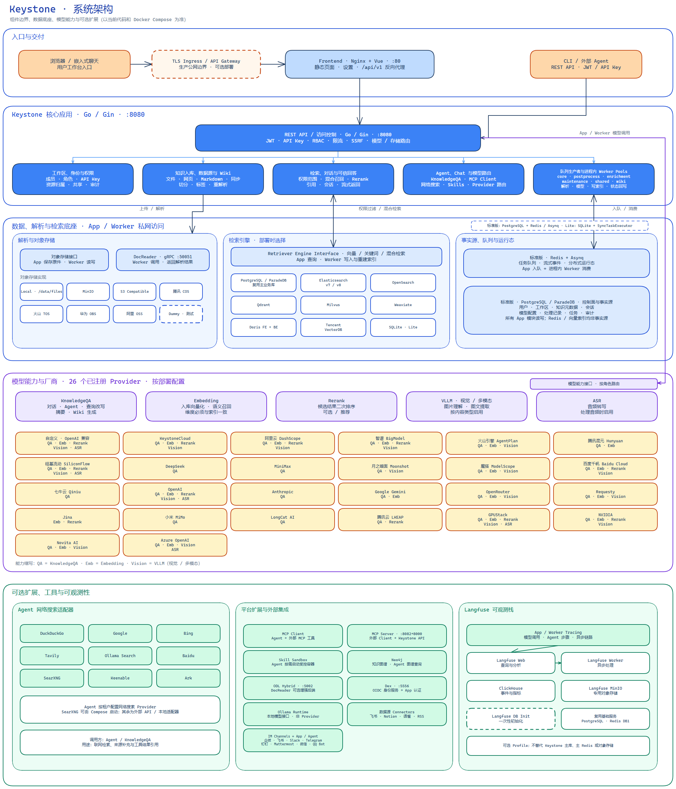
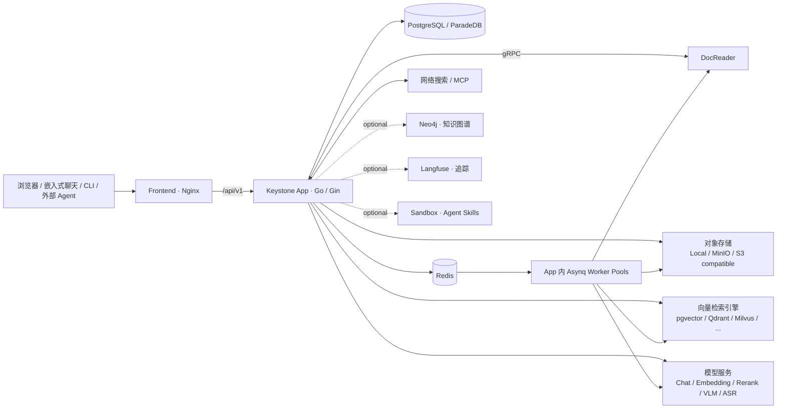
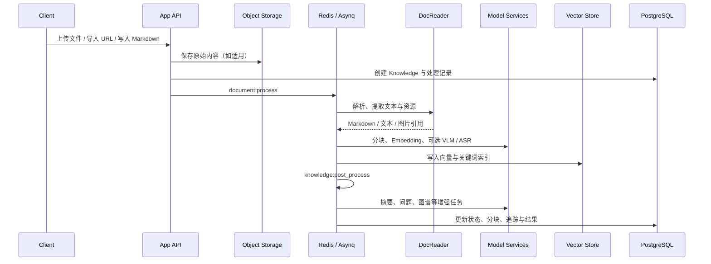

# Keystone 开发必读：系统、基础设施与模型架构

> 本文是 Keystone 的开发与部署事实基线，面向单机、私有云与生产集群。它描述当前代码与 `docker-compose.yml` 的实际组件边界、数据流和调度模型；配置项以 `.env.example` 为准。新功能、部署变更或模型接入前应先阅读本文。项目按私有部署和受控维护设计，不应将示例配置、镜像标签或外部服务地址视为公共承诺。

> 当前生产实例的具体主机、域名、云端 Compose、托管 Tair/OSS、模型配置和操作步骤见[部署与运维手册](./DEPLOYMENT_RUNBOOK.md)。本文件解释通用架构与代码边界；运行手册解释当前实例如何落地这些边界。

## 当前生产实现（2026-07-28）

生产环境采用杭州 ECS 单机 Compose：Frontend、App、ParadeDB/PostgreSQL、Qdrant 和 DocReader 在同一私有 Docker 网络；宿主机 Nginx 终止 HTTPS；Redis/Asynq 使用同 VPC 的阿里云 Tair；对象文件使用阿里云 OSS；Embedding 使用硅基流动 `BAAI/bge-m3`（1024 维），问答、摘要与推荐问题使用火山 AgentPlan `doubao-seed-2.0-pro`。WireGuard、本机 MinIO/Ollama 和本地 Docker 不在当前生产链路中。



可编辑源文件：[系统架构 Excalidraw](./diagrams/keystone-system-architecture-grid.excalidraw)；完整业务能力图见[业务功能架构](./diagrams/keystone-business-architecture.png)。

## 开发导航：先读什么、改哪里

| 目标 | 首选位置 | 约束 |
| --- | --- | --- |
| HTTP 路由、认证与权限 | `internal/router/`、`internal/handler/`、`internal/middleware/` | 所有资源访问都必须经过工作区、角色和 API Key 策略。 |
| 核心业务与后台任务 | `internal/application/service/` | 知识处理、检索、聊天、Agent、Wiki 与数据源在此编排；任务必须可重试且幂等。 |
| 数据与外部适配 | `internal/application/repository/`、`internal/container/engine_factory.go` | 新存储或向量引擎实现既有接口，并由容器工厂注册。 |
| 进程启动与依赖注入 | `cmd/server/main.go`、`internal/container/container.go` | 容器负责连接、路由和 worker；不要在包初始化时创建外部连接。 |
| 前端工作台 | `frontend/src/` | Vue 3 + TDesign；API、路由、Pinia 和本地偏好必须保持兼容。 |
| 文档解析 | `docreader/`、`internal/infrastructure/docparser/` | 简单文本格式可由 Go 原生处理，复杂格式经 DocReader。 |
| 部署与密钥 | `.env.example`、`docker-compose.yml`、`config/` | `.env`、本地卷、令牌与密码不得提交。 |

推荐改动路径：路由/DTO → service → repository 或 provider → 测试 → 前端。跨边界功能必须同时说明迁移、队列、权限、配置键和回滚方式。

## 1. 设计目标

Keystone 是一个自托管知识工作台：将文件、网页和 Markdown 处理为可检索的知识，再由对话和智能体调用。设计重点是：

- **可替换**：模型、向量库、对象存储、文档解析器和搜索服务均通过配置或管理界面替换。
- **可恢复**：原始文件、关系数据、向量索引和任务状态分开持久化，可按组件备份和恢复。
- **不阻塞交互**：上传、解析、向量化、Wiki 构建与外部数据源同步进入异步队列；用户对话保持独立的低延迟路径。
- **可隔离**：工作区、API Key、资源归属和角色权限在应用层实施；模型凭据以加密字段保存。
- **可观测**：应用日志、任务队列状态、解析流水线和可选 Langfuse 调用链共同定位问题。

## 2. 总体拓扑



### 2.1 核心服务

| 组件 | 当前实现 | 职责 | 是否必须 |
| --- | --- | --- | --- |
| `frontend` | Nginx + Vue 前端 | 承载工作台与静态资源，反向代理 API | 是 |
| `app` | Go / Gin | REST API、鉴权、业务服务、模型路由、队列生产者与 worker | 是 |
| `postgres` | PostgreSQL / ParadeDB | 用户、工作区、知识元数据、会话、模型配置、任务与审计数据 | 是 |
| `redis` | Redis + Asynq | 异步任务队列、流式事件、分布式协作状态 | 标准版是 |
| `docreader` | gRPC 服务 | PDF、Office、图片、网页等文档解析与渲染 | 标准版是 |
| 向量库 | 由 `RETRIEVE_DRIVER` 或管理界面选择 | 向量、关键词或混合索引 | 是 |
| 对象存储 | Local / MinIO / S3 兼容等 | 原始文件、解析附件和生成文件 | 是 |

可选组件包括 MinIO、Neo4j、SearXNG、Langfuse、MCP 服务、Skill Sandbox、OpenDataLoader Hybrid，以及额外的向量数据库容器。它们通过 Docker Compose profile 启用，不能因为启用 profile 而替代 PostgreSQL、Redis 或 DocReader 的职责。

### 2.2 网络与端口边界

| 端口 / 协议 | 所属组件 | 建议 |
| --- | --- | --- |
| `80`（可由 `FRONTEND_PORT` 覆盖） | Frontend | 唯一需要对终端用户暴露的 HTTP 入口；生产环境应由 TLS Ingress / 反向代理终止 HTTPS。 |
| `8080` | App | API 与健康检查；生产环境仅对 Frontend 或网关开放。 |
| `50051` / gRPC | DocReader | 仅限内部网络，不应直接暴露到公网。 |
| PostgreSQL、Redis、向量库端口 | 数据组件 | 仅限私有网络；不通过公网发布。 |
| `8082`（可选） | MCP | 仅在需要对外提供 MCP 时开放，并使用独立 API Key 与网关策略。 |

## 3. 功能分层与数据所有权

| 层 | 主要目录 / 组件 | 职责 | 持久化位置 |
| --- | --- | --- | --- |
| 展示层 | `frontend/` | 工作台、设置、知识库、聊天、智能体、嵌入式聊天 | 浏览器偏好；后端同步的用户设置 |
| API 与鉴权 | `internal/router/`、`internal/handler/`、`internal/middleware/` | REST API、JWT、API Key、RBAC、SSRF 防护、限流 | PostgreSQL |
| 业务层 | `internal/application/service/`、`internal/agent/` | 知识处理、检索、聊天、智能体、Wiki、MCP、数据源 | PostgreSQL + Redis + 外部组件 |
| 适配层 | `internal/models/`、`internal/storage/`、`internal/application/repository/` | 模型提供商、对象存储、向量库、关系库适配 | 取决于适配器 |
| 基础设施 | `internal/container/`、`internal/runtime/`、`internal/tracing/` | 依赖注入、启动、连接池、资源清理、观测 | 无业务数据 |

数据必须按以下边界理解：

- **PostgreSQL 是控制面与事实源**：知识库、知识条目、解析状态、工作区、用户、模型、连接配置、会话、Wiki 页面、任务死信等都在这里。
- **对象存储保存原始内容**：不要只备份数据库；缺少原文件会使重新解析、附件预览和恢复受限。
- **向量库是可重建索引，但重建成本高**：集合名称受 embedding 维度和配置影响，恢复时必须使用与原知识库兼容的模型与维度。
- **Redis 保存运行态**：队列、流式消息和调度状态不可作为唯一事实源；任务可能重试，因此业务处理必须保持幂等。

## 4. 文档入库与 Wiki 流水线



对于 Wiki 知识库，文档处理完成后会触发专用 `wiki` 队列。它基于选择的 Wiki 模板、提取颗粒度和内容生成要求，将实体、概念和页面写入 PostgreSQL，并把 Wiki 页面作为可检索内容同步到索引。`wiki:finalize` 是知识库级的防抖收尾任务，用于整理链接、索引与一致性工作。

### 4.1 处理失败的判断顺序

1. 检查文档解析器是否健康，以及文件是否能从对象存储读取。
2. 检查 embedding 模型的 API Key、Base URL、模型名与并发限制。
3. 检查向量库连接、集合维度、鉴权与集合是否存在。
4. 在运行时任务页面或 Redis/应用日志查看队列状态与重试原因。
5. 对耗尽重试的任务检查死信记录；对应知识条目会被标记为失败，而不是永久停留在处理中。

## 5. 对话、检索与智能体

一次知识问答遵循以下路径：

1. 客户端携带登录态或 API Key 调用 App。
2. App 按工作区与知识库权限解析会话范围。
3. 可选执行查询改写与扩展，再从向量库/关键词索引召回候选分块。
4. 可选使用 Rerank 模型重排候选，保留引用元数据。
5. Chat 模型以检索结果、系统提示词和会话上下文生成流式回答。
6. Agent 模式还可根据策略调用知识检索、MCP 工具和网络搜索；需要审批的 MCP 工具会经过审批门。
7. App 将消息、引用、会话状态和审计信息写回 PostgreSQL，并经 Redis 向前端发送流式事件。

交互式对话优先保障响应时间；后台入库与增强任务会受到模型并发治理，避免大量上传耗尽模型服务的请求配额。

## 6. 模型组件与调度原则

### 6.1 模型角色

| 模型类型 | 用途 | 最低部署要求 |
| --- | --- | --- |
| `KnowledgeQA` | 对话、Agent 推理、查询改写、摘要与 Wiki 生成 | 至少一个可用模型 |
| `Embedding` | 入库向量化与语义召回 | 至少一个可用模型；维度必须与目标索引一致 |
| `Rerank` | 对召回结果二次排序 | 推荐；不是所有知识库的硬依赖 |
| `VLLM` | 图像理解、图文内容提取等多模态任务 | 仅在启用图像多模态处理时需要 |
| `ASR` | 音频转写 | 仅在处理音频时需要 |

模型可由控制台录入，也可通过 `config/builtin_models.yaml` 声明并用环境变量注入凭据。每个模型的显示名与实际调用名分离；部署时应固定实际模型名、Base URL、API Key、接口类型和 embedding 维度。

### 6.2 并发治理

- `KEYSTONE_MODEL_MAX_CONCURRENCY`：后台模型调用的全局上限，默认 `32`。
- `Model.Parameters.MaxConcurrency`：单个模型的后台调用上限；`0` 时继承全局值。
- 前台交互式聊天不使用该后台限流器；上传、解析增强、Wiki 构建等后台调用受限流器控制。
- 当上游返回 `429`、限速或配额不足时，应先降低 worker/模型并发，再增加上游配额；不要只盲目增加队列 worker。

建议的起点：单个远程 embedding 模型设置较低的并发（例如 2–5），确认稳定后逐步增加；对话模型、Rerank 与多模态模型分别独立评估。模型服务、DocReader 和向量库才是入库吞吐的共同瓶颈。

### 6.3 配置与调用契约

模型以 `internal/types/model.go` 的类型定义和模型配置为边界；配置可由管理界面持久化，或通过 `config/builtin_models.yaml`（基于 `.example`）声明。显示名称与实际调用模型名、Base URL、Provider、API Key、参数和并发限制是不同字段，生产变更必须一并核验。

- `KnowledgeQA`：聊天、Agent 推理、查询改写、摘要和 Wiki 生成；前台流式聊天不受后台模型门控。
- `Embedding`：文档分块入库和语义查询；模型维度必须与目标索引一致，换维度须新建索引或完整回填。
- `Rerank`：只重排召回候选；其分数不能与向量相似度直接混用。
- `VLLM`：图像理解、扫描件或图文提取；仅在相应处理开启时调用，受超时和后台限流约束。
- `ASR`：音频转写；需同时评估音频大小、时长和上游配额。

模型密钥只能由 `.env`、受控密钥系统或加密存储提供，不得写入文档、示例中的真实值或日志。

### 6.4 向量与检索引擎边界

`RETRIEVE_DRIVER` 决定启动时可用的默认检索实现；管理界面的 VectorStore 配置由 `internal/container/engine_factory.go` 动态创建。已实现后端位于 `internal/application/repository/retriever/`。

| 引擎 | 实现目录 | 运维要点 |
| --- | --- | --- |
| PostgreSQL / ParadeDB | `postgres/` | 关系数据与检索同域；关注数据库容量、索引构建和 SQL 负载。 |
| Qdrant | `qdrant/` | 保存 collection 前缀、向量维度、距离度量与快照。 |
| Milvus | `milvus/` | 保持 collection、metric 和索引参数一致。 |
| Weaviate | `weaviate/` | 同时检查 HTTP、gRPC、认证和 schema。 |
| Elasticsearch v7/v8 | `elasticsearch/` | 客户端实现必须与服务版本匹配。 |
| OpenSearch | `opensearch/` | 保存 index mapping 与插件能力。 |
| Doris | `doris/` | 确认表前缀、兼容模式和多维度表策略。 |
| Tencent VectorDB | `tencentvectordb/` | 记录地址、数据库、集合前缀、副本和鉴权。 |
| SQLite | `sqlite/` | 适合 Lite/受限环境，不按高并发集群设计。 |
| Neo4j | `neo4j/` | 图谱增强，不替代主向量检索。 |

检索前必须完成权限与知识库范围限制；检索后才允许 Rerank 重排。Embedding 模型、维度、距离度量、collection/index 前缀或分块策略改变都可能使旧索引失效，必须明确“新建并回填”或“停机重建”的计划。

## 7. 异步调度架构

App 进程内运行多个独立 Asynq Server；它们共用 Redis，但具有硬隔离的并发预算。因此部署一个 App 副本不仅增加 API 吞吐，也会增加该副本的后台 worker 容量。

| Worker 池 | 默认并发 | 队列 | 典型任务 | 调整变量 |
| --- | ---: | --- | --- | --- |
| `core` | 8 | `default` | 文档解析、手工更新 | `KEYSTONE_ASYNQ_CORE_CONCURRENCY` |
| `postprocess` | 2 | `postprocess` | 入库后的统一后处理调度 | `KEYSTONE_ASYNQ_POSTPROCESS_CONCURRENCY` |
| `enrichment` | 12 | `summary`、`multimodal`、`graph`、`question` | 摘要、图片理解、图谱抽取、问题生成 | `KEYSTONE_ASYNQ_ENRICHMENT_CONCURRENCY` |
| `maintenance` | 4 | `sync`、`low` | 数据源同步、删除、迁移、复制、重解析 | `KEYSTONE_ASYNQ_MAINTENANCE_CONCURRENCY` |
| `shared` | 6 | 可弹性消费 `default` 与 enrichment 队列 | 高峰期借用处理能力 | `KEYSTONE_ASYNQ_SHARED_CONCURRENCY` |
| `wiki` | 8 | `wiki` | Wiki 页面生成与收尾 | `KEYSTONE_WIKI_ASYNQ_CONCURRENCY` |

调度注意事项：

- `low` 是维护队列的物理 Redis 名称，为滚动升级兼容而保留；不要手动改名或清空。
- 队列任务具备重试、超时与死信记录。服务端应以“至少一次执行”设计处理，不假设严格一次执行。
- `shared` 只借用核心和增强队列，不消费后处理与维护队列，避免长维护任务影响用户可见流水线。
- 多副本 App 可以共同消费同一 Redis 队列，Redis 的原子领取保证同一个队列消息不会被两个 worker 同时领取；业务处理仍须幂等以抵御超时重试。
- 数据源定时同步使用确定性任务 ID 与运行状态检查，减少多副本下的重复触发。

## 8. 部署模式

### 8.1 本地与验证环境

适用于单人开发、模型接入验证和功能演示。

```bash
cp .env.example .env
docker compose --profile minio --profile qdrant up -d
```

建议使用 MinIO + Qdrant 以获得与生产较接近的对象存储和向量库行为。不要把 `.env`、`.local-data` 或 Docker 卷提交到 Git。

### 8.2 单机生产环境

适用于小团队或内网部署：

- 前端、App、PostgreSQL、Redis、DocReader、MinIO/Qdrant 可在一台受管主机上运行。
- 使用宿主机快照之外的备份目标，分别备份 PostgreSQL、对象存储和向量库数据。
- 只暴露 HTTPS 网关；其余端口绑定私有网络。
- 将 `.env` 放入受控的密钥管理或受限权限目录，替换示例中的默认密码、JWT 和 AES 密钥。
- 使用固定镜像版本，而不是长期依赖 `latest`。

### 8.3 高可用 / Kubernetes 环境

适用于有持续入库和多用户访问的场景：

- Frontend 与 App 可水平扩展；所有副本必须连接到同一 PostgreSQL、Redis、对象存储和向量库。
- 计算总 worker 容量时使用“每个 App 副本的池并发 × 副本数”，再与模型 QPS、DocReader CPU 和向量库写入能力一起设上限。
- PostgreSQL、Redis、对象存储、向量库应使用托管服务或具备持久卷、故障转移和独立备份策略的集群。
- DocReader 为 CPU/内存密集型服务，应独立扩缩容；当其扩容为多个副本时，通过稳定的服务发现地址供 App 调用。
- 通过 Ingress 或 API Gateway 处理 TLS、域名、上传体积限制、WAF 与访问日志；不要让 App/DocReader/数据库直接暴露公网。
- 滚动升级前先完成备份和预发布验证；升级期间不要随意更改队列名、Redis 前缀、对象存储路径或向量集合前缀。

## 9. 配置与密钥基线

生产部署至少应审查以下配置类别：

| 类别 | 关键项 | 要求 |
| --- | --- | --- |
| 身份与加密 | `JWT_SECRET`、`TENANT_AES_KEY`、`SYSTEM_AES_KEY`、`CRYPTO_MASTER_KEY`、`CRYPTO_SALT` | 使用随机强密钥；密钥轮换前先验证旧密钥兼容策略。 |
| 关系与队列 | `DB_*`、`REDIS_*`、`STREAM_MANAGER_TYPE` | 使用独立账号、私有网络和 TLS（服务支持时）。 |
| 文件与索引 | `STORAGE_TYPE`、对象存储凭据、`RETRIEVE_DRIVER`、向量库连接 | 先确认网络、鉴权、集合前缀及 embedding 维度。 |
| 模型 | Base URL、API Key、模型名、Provider、并发限制 | 通过“测试连接”验证；模型名称不能为空。 |
| 网络安全 | `SSRF_WHITELIST`、`SSRF_WHITELIST_EXTRA`、`APP_EXTERNAL_URL` | 白名单仅加入必要的内网服务，不允许泛化到整个私网。 |
| 访问控制 | `DISABLE_REGISTRATION`、RBAC、API Key、嵌入式聊天域名策略 | 公网或共享部署应关闭任意注册或限制为邀请制。 |

> `CRYPTO_MASTER_KEY` / `CRYPTO_SALT` 未设置时会写入持久化文件以支持重启恢复。生产环境仍建议显式由密钥管理系统注入，并把恢复材料纳入备份和灾备演练。

## 10. 备份、恢复与升级

### 10.1 备份最小集合

1. PostgreSQL：全量备份 + 定期 WAL/增量策略。
2. 对象存储：存储桶及其版本/生命周期策略；本地存储则备份 `data-files` 卷。
3. 向量库：快照或集合备份；记录模型、维度、集合前缀和知识库映射。
4. 配置与密钥：经过加密保护的 `.env`、`config/` 中的部署配置、密钥管理系统记录。
5. 可选组件：Neo4j、Langfuse ClickHouse/MinIO 等分别备份。

Redis 主要保存运行态，一般不替代上述备份；升级前应让关键队列排空或记录待处理任务，并确认死信队列没有未处理的失败项。

### 10.2 恢复顺序

1. 恢复密钥和基础配置，启动 PostgreSQL、对象存储、Redis、向量库。
2. 恢复 PostgreSQL 和原始文件，再恢复向量库快照；若无法恢复向量索引，使用原始文件重新解析和向量化。
3. 启动 DocReader 与 App，检查 `/health`、数据库连接、对象存储和向量库测试连接。
4. 启动 Frontend，验证登录、知识库列表、一个历史文件预览、混合检索和流式问答。
5. 最后恢复外部数据源同步、MCP 和定时任务，避免恢复过程产生重复导入。

## 11. 上线检查清单

- [ ] 所有示例密码、JWT、AES 密钥和模型 API Key 均已替换，并未出现在 Git 或镜像层中。
- [ ] PostgreSQL、对象存储、向量库均已完成一次可验证备份与恢复演练。
- [ ] Embedding 模型维度与已有向量集合一致；Rerank/Chat 模型测试连接成功。
- [ ] App、DocReader、向量库、对象存储、Redis 均通过健康检查或连通性检查。
- [ ] 队列积压、失败/死信任务、模型 `429` 与向量库写入错误已纳入监控告警。
- [ ] 仅网关暴露公网端口；DocReader、Redis、数据库、向量库仅在私网可达。
- [ ] 生产部署使用固定镜像标签与明确的回滚版本；升级前已在预发布环境验证。
- [ ] 已验证一个完整路径：上传 → 解析 → 向量化 → 检索 → 对话引用 → 删除/重解析。
- [ ] 新 API 已定义权限、输入验证、审计需要和错误边界；新任务具备幂等性、超时和死信可观测性。
- [ ] 涉及 Embedding 时已核验维度、索引/集合与回填策略；新 Provider 已覆盖凭据、连接检测和 SSRF 约束。
- [ ] 已运行与改动相关的最小检查；前端改动至少执行 `npm --prefix frontend run type-check`、`npm --prefix frontend run build` 和 `git diff --check`。

## 12. 相关文件

- [Docker Compose 主拓扑](../docker-compose.yml)
- [部署环境变量模板](../.env.example)
- [应用基础配置](../config/config.yaml)
- [任务队列定义](../internal/types/task.go)
- [Worker 启动与任务注册](../internal/router/task.go)
- [内置模型声明示例](../config/builtin_models.yaml.example)
- [向量数据库说明](./使用其他向量数据库.md)
- [迁移排障](./migration-troubleshooting.md)
