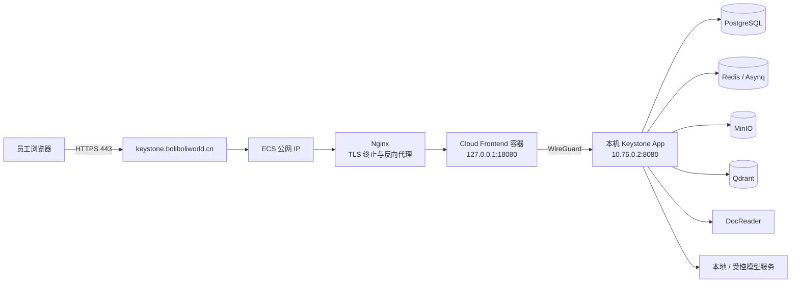

# Keystone 部署与运维手册（新员工必读）

> 适用范围：当前生产部署、日常值守、故障排查和后续迁移。本文描述的是已验证的实际架构，不包含密码、私钥、令牌或模型 API Key。任何人在修改 DNS、WireGuard、反向代理、模型、向量库或 Compose 文件前，必须先阅读本文和 [系统架构](./ARCHITECTURE.md)。

## 1. 先理解当前部署：应用入口在云端，业务状态在本机

当前生产访问地址是：<https://keystone.boliboliworld.cn>。

系统不是把所有容器都放在 ECS 上，而是采用“云端公网入口 + 本机受控运行环境”的混合部署。原因是本机保存了现有 Keystone 的数据库、对象文件、向量索引、模型连接和加密状态；直接在云端复制 App 并同时运行后台 worker，会造成凭据复制、队列重复消费和数据不一致风险。



### 1.1 组件归属

| 位置 | 组件 | 职责 | 是否公网开放 |
| --- | --- | --- | --- |
| 阿里云 ECS | Nginx | 域名、HTTPS、将请求代理到云端前端容器 | 仅 80/443 |
| 阿里云 ECS | `keystone-cloud-frontend` | 前端静态资源与 `/api` 代理 | 仅 `127.0.0.1:18080` |
| 本机 | WireGuard | 云端与本机的私有加密网络 | 仅 VPN 对等端 |
| 本机 | `Keystone-app` | API、登录、业务、任务生产和 Asynq worker | 通过 VPN 提供给云端前端 |
| 本机 | PostgreSQL / Redis / MinIO / Qdrant / DocReader | 业务数据、队列、文件、检索、解析 | 不对公网开放 |
| 本机或受控网络 | 模型服务 | Chat、Embedding、Rerank、VLM、ASR 等 | 仅 App 可访问 |

**最重要的边界**：浏览器从不直接访问 PostgreSQL、Redis、MinIO、Qdrant、DocReader 或模型服务。它们只能由 App 在内网或 WireGuard 网络中访问。

## 2. 网络、DNS 与端口

### 2.1 已固定的网络关系

| 项目 | 当前值 / 约束 |
| --- | --- |
| 公网域名 | `keystone.boliboliworld.cn` |
| ECS 公网 IP | `8.136.98.84` |
| DNS | A 记录：`keystone` → `8.136.98.84` |
| 云端 WireGuard 地址 | `10.76.0.1/24` |
| 本机 WireGuard 地址 | `10.76.0.2/24` |
| WireGuard UDP 端口 | `51820`，安全组仅允许本机当前公网出口地址 |
| ECS 前端容器绑定 | `127.0.0.1:18080`，由 Nginx 转发 |
| 本机 Keystone App | `10.76.0.2:8080`，只由 ECS 前端经 VPN 使用 |

### 2.2 本机专用服务端口

下列端口通过 [`docker-compose.wireguard.yml`](../docker-compose.wireguard.yml) 绑定到 `10.76.0.2`，用于“将来把 App 放到云端”的模式或受控诊断；它们不应加入公网安全组。

| 服务 | 本机 WireGuard 地址 | 容器端口 |
| --- | --- | --- |
| PostgreSQL | `10.76.0.2:15432` | `5432` |
| Redis | `10.76.0.2:16379` | `6379` |
| MinIO S3 API | `10.76.0.2:19000` | `9000` |
| Qdrant gRPC | `10.76.0.2:16334` | `6334` |
| DocReader gRPC | `10.76.0.2:15051` | `50051` |

这些端口必须只允许 WireGuard 云端地址 `10.76.0.1` 访问。不要因为排障方便而映射到 `0.0.0.0`，也不要把它们写入 ECS 安全组的公网规则。

## 3. HTTPS 与域名证书

ECS Nginx 为 `keystone.boliboliworld.cn` 提供 TLS，Let’s Encrypt 证书由 Certbot 管理。证书文件位于：

```text
/etc/letsencrypt/live/keystone.boliboliworld.cn/
```

Nginx 站点配置位于：

```text
/etc/nginx/conf.d/keystone.boliboliworld.cn.conf
```

该站点将 HTTPS 请求转发给 `127.0.0.1:18080`，并已启用 HTTP → HTTPS 跳转和 HSTS。不要手工删除 Certbot 管理的 `listen 443`、`ssl_certificate` 或 `ssl_certificate_key` 行。

证书检查：

```bash
sudo certbot certificates
sudo systemctl status certbot-renew.timer
curl -I https://keystone.boliboliworld.cn/
```

如果浏览器刚访问过旧的 HTTP 或旧证书页面，使用强制刷新后再判断；不要仅依据浏览器缓存提示修改证书。

## 4. 本机服务启动与重启

### 4.1 前置条件

1. Windows 已安装 Docker Desktop，并处于运行状态。
2. WireGuard 隧道 `hangzhou` 已连接，地址为 `10.76.0.2/24`。
3. 本机仓库位于受控目录，`.env` 存在且未提交。
4. 不得把 `.env`、WireGuard 私钥、数据库导出文件或模型密钥复制到 Git、聊天或工单正文。

### 4.2 启动完整本机后端

在仓库根目录执行：

```powershell
docker compose -f docker-compose.yml -f docker-compose.wireguard.yml `
  --profile minio --profile qdrant up -d
```

检查状态：

```powershell
docker compose -f docker-compose.yml -f docker-compose.wireguard.yml ps
docker inspect --format '{{.Name}} {{if .State.Health}}{{.State.Health.Status}}{{else}}{{.State.Status}}{{end}}' `
  Keystone-app Keystone-postgres Keystone-docreader
```

预期结果：`Keystone-app`、`Keystone-postgres`、`Keystone-docreader` 为 `healthy`；Redis 与 Qdrant 处于 `running`；MinIO 健康检查通过。

### 4.3 为什么不能同时启动第二个云端 App

当前本机 `Keystone-app` 已运行 API 与后台 worker。若另一个云端 App 使用同一个 PostgreSQL、Redis、对象存储和 Qdrant：

- 两个 worker 会共同消费队列，吞吐和副作用变得难以预期；
- 加密密钥不一致会导致既有敏感配置无法解密；
- 本机与云端的配置、模型和文件状态容易漂移；
- 排障时无法判断请求或任务由哪个 App 执行。

因此当前生产模式只在 ECS 运行前端代理。要迁移为“云端 App + 本机组件”，必须先完成密钥托管、worker 拆分/停用本机 worker、回滚方案和预发布验证；具体模板见 [`deploy/cloud-app/`](../deploy/cloud-app/)。

## 5. ECS 服务操作

通过受控 SSH 登录 ECS 后执行。不要在共享终端粘贴 `.env` 内容。

### 5.1 查看云端入口容器与 Nginx

```bash
docker ps --filter name=keystone-cloud-frontend
curl -I http://127.0.0.1:18080/
sudo nginx -t
sudo systemctl status nginx
curl -I https://keystone.boliboliworld.cn/
```

### 5.2 重启顺序

正常情况下只重启故障组件，不要无差别重启整台服务器：

```bash
# 仅刷新云端前端容器
docker restart keystone-cloud-frontend

# 仅重新加载 Nginx 配置
sudo nginx -t && sudo systemctl reload nginx

# 检查 WireGuard
sudo wg show wg0
ip addr show wg0
```

如果重启 Docker，容器配置了 `--restart unless-stopped`，应会自动恢复；仍须执行 `docker ps` 和公网 `curl` 验证。

## 6. 日常健康检查与故障定位

按“入口 → VPN → App → 依赖”的顺序检查，不要从数据库开始盲目重启。

| 现象 | 首先检查 | 常见原因 | 处理方向 |
| --- | --- | --- | --- |
| 域名无法访问 | DNS A 记录、ECS 80/443、安全组 | DNS 未生效、网关未运行 | `Resolve-DnsName`、`nginx -t`、检查安全组 |
| HTTPS 报错 | 证书、域名、浏览器缓存 | 域名不匹配、证书续期失败、旧缓存 | `certbot certificates`，确认访问完整 HTTPS 域名 |
| 页面能打开但登录/API失败 | ECS 前端 → VPN → 本机 App | WireGuard 断开、本机 Docker 未启动 | `wg show`，检查 `Keystone-app` 健康状态 |
| 上传/解析失败 | DocReader、MinIO、Redis、模型服务 | 组件未启动、对象存储或模型不可达 | 检查本机容器、App 日志与任务失败原因 |
| 检索无结果 | Embedding、Qdrant、知识库状态 | 模型维度/collection 不一致，入库未完成 | 核对模型配置、collection 与任务状态 |
| 队列积压 | Redis 与 App worker | 模型限流、DocReader CPU 不足、上游 429 | 降低并发，先恢复上游依赖 |

常用命令：

```powershell
# 本机
docker compose -f docker-compose.yml -f docker-compose.wireguard.yml logs --tail 200 app
docker compose -f docker-compose.yml -f docker-compose.wireguard.yml logs --tail 200 docreader
```

```bash
# ECS
docker logs --tail 200 keystone-cloud-frontend
sudo journalctl -u nginx -n 100 --no-pager
sudo wg show wg0
```

日志可能包含文件名、业务错误或网络地址；对外分享前必须脱敏，不能复制 `.env`、Authorization、Cookie 或模型 Key。

## 7. 模型、向量库与数据边界

新员工需要区分三类数据：

1. **PostgreSQL**：用户、空间、知识库元数据、消息、模型配置和审计事实源。
2. **MinIO / 对象存储**：原始文件与解析附件；数据库备份不包含这些原文件。
3. **Qdrant / 向量库**：可由原始文件重建但成本较高的检索索引。

Embedding 模型的维度、距离度量、分块策略和 collection 命名共同决定索引兼容性。更换 embedding 模型或维度时，必须新建/重建索引，不得直接复用旧 collection。Rerank 只负责候选重排；Chat 模型负责回答与 Agent 推理；VLM/ASR 只在图像或音频流程启用。详细实现边界见 [系统架构的模型与向量章节](./ARCHITECTURE.md#6-模型组件与调度原则)。

## 8. 备份、变更与回滚

### 8.1 最小备份集合

- PostgreSQL 逻辑备份或受控快照；
- MinIO bucket 与版本策略；
- Qdrant collection 快照；
- 加密保存的部署配置与密钥恢复材料；
- 记录当前 Git commit、容器镜像标签、模型名和 embedding 维度。

Redis 不应作为唯一事实源。恢复时优先恢复密钥/配置、PostgreSQL、对象存储和向量库，再启动 DocReader、App 和前端。

### 8.2 变更规则

- 修改 DNS、Nginx、WireGuard、安全组或端口前，先写出回滚命令并在变更后立刻验证。
- 修改模型、向量 collection、存储桶或 worker 并发前，先确认影响范围和回填计划。
- 不使用 `latest` 作为长期生产升级策略；升级使用已验证的 Git commit 或固定镜像标签。
- 不用 `docker compose down -v`、`docker system prune -a` 或删除卷作为常规排障手段。

## 9. 新员工首日交接清单

- [ ] 能说明“ECS 只负责公网入口，本机 App 负责业务与数据”的原因。
- [ ] 能在不查看密钥的前提下确认 DNS、HTTPS、Nginx、WireGuard、Docker 容器健康状态。
- [ ] 知道 PostgreSQL、对象存储、Qdrant 的数据职责和备份方式。
- [ ] 知道模型变更可能导致向量维度和索引不兼容。
- [ ] 知道不得暴露数据库、Redis、DocReader、Qdrant 或模型端口到公网。
- [ ] 能完成一次只读验证：打开域名、检查 HTTPS、查看本机与 ECS 容器状态。
- [ ] 能在变更前找到回滚版本、负责人和备份验证记录。

## 10. 关联文档

- [系统、组件、模型与向量架构](./ARCHITECTURE.md)
- [云端 App 部署模板与迁移模式](../deploy/cloud-app/README.md)
- [WireGuard 本机端口覆盖](../docker-compose.wireguard.yml)
- [环境变量样例](../.env.example)
- [内置模型样例](../config/builtin_models.yaml.example)
