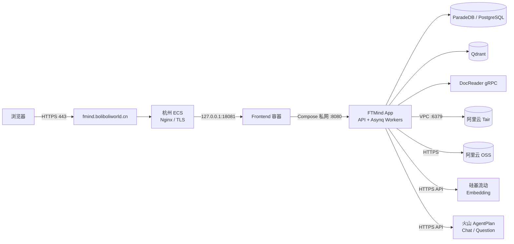

# FTMind 部署与运维手册（新员工必读）

> 本文是当前生产实例的事实基线，校准日期为 2026-07-28。它用于部署、值守、排障、备份和回滚，不记录任何密码、私钥、AccessKey 或模型 API Key。通用代码与组件边界见[开发与系统架构](./ARCHITECTURE.md)。

## 1. 当前生产结论

FTMind 已采用“杭州 ECS 单机应用栈 + 阿里云托管 Tair/OSS + 远程模型 API”的纯云 MVP 架构。历史上的 WireGuard、本机 Docker、MinIO 和本地模型不再是生产请求链路的一部分。

| 项目 | 当前值 |
| --- | --- |
| 访问地址 | `https://fmind.boliboliworld.cn` |
| ECS | 华东 1（杭州），`2 vCPU / 4 GiB`，公网 `8.136.98.84`，私网 `172.19.172.202` |
| 系统盘 | 100 GiB 文件系统；2026-07-28 实测约 41 GiB 已用、54 GiB 可用 |
| 部署目录 | `/opt/fmind/deploy/cloud-mvp` |
| Compose 项目 | `fmind-mvp` |
| 公网入口 | 宿主机 Nginx：80/443；前端只绑定 `127.0.0.1:18081` |
| 应用容器 | Frontend、App、ParadeDB/PostgreSQL、Qdrant、DocReader |
| 托管服务 | 阿里云 Tair（Redis 兼容）、阿里云 OSS |
| 当前 Embedding | 硅基流动 `BAAI/bge-m3`，1024 维 |
| 当前问答/问题生成 | 火山引擎 AgentPlan `doubao-seed-2.0-pro` |

2C4G 是单用户/小团队 MVP 下限，不是高并发生产规格。当前所有模型和 Asynq worker 并发均从 1 起步；批量导入期间应观察内存、Swap、队列和模型限流。

## 2. 部署架构



### 2.1 组件职责与数据边界

| 组件 | 部署位置 | 职责 | 数据性质 | 公网暴露 |
| --- | --- | --- | --- | --- |
| Nginx | ECS 宿主机 | TLS、域名、HTTP→HTTPS、反向代理 | 配置和访问日志 | 80/443 |
| Frontend | Docker | Vue 静态资源与 `/api` 代理 | 无业务事实数据 | 仅 127.0.0.1:18081 |
| App | Docker | REST API、鉴权、业务编排、模型路由、Asynq worker | 本地状态卷仅作应用辅助 | 否 |
| PostgreSQL | Docker volume | 用户、空间、知识库、模型配置、会话、任务与审计事实源 | 核心数据 | 否 |
| Qdrant | Docker volume | 1024 维向量索引与检索 | 可重建但重建成本高 | 否 |
| DocReader | Docker | PDF/Office 等基础文本解析 | 临时结果 | 否 |
| Tair | 阿里云 VPC | Redis/Asynq 队列、流式事件与运行态 | 非唯一事实源 | 否 |
| OSS | 阿里云 | 原始文件、解析附件与生成文件 | 核心文件资产 | 仅服务 API |
| 模型服务 | 硅基流动/火山 | Embedding、问答、摘要、问题生成 | 外部计算能力 | 仅 App 出站访问 |

浏览器不得直接访问 PostgreSQL、Qdrant、DocReader、Tair 或 OSS 凭据接口。数据库与向量端口只存在于 Compose 网络，Tair 只允许 ECS 私网 IP。

## 3. 代码、配置和密钥位置

| 内容 | 位置 | 是否进入 Git |
| --- | --- | --- |
| 云端 Compose | `deploy/cloud-mvp/docker-compose.yml` | 是 |
| 配置模板 | `deploy/cloud-mvp/.env.example` | 是，仅占位符 |
| 生产配置 | `/opt/fmind/deploy/cloud-mvp/.env` | 否，权限必须为 `600` |
| Nginx 站点 | `/etc/nginx/conf.d/fmind.boliboliworld.cn.conf` | 服务器受控配置 |
| TLS 证书 | `/etc/letsencrypt/live/fmind.boliboliworld.cn/` | 否 |
| 数据卷 | Docker volumes：PostgreSQL、Qdrant、App、DocReader 临时卷 | 否 |
| 备份目录 | `/opt/fmind/backups/` | 否 |

生产 `.env` 必须包含随机数据库、JWT、AES、主密钥与盐，以及 Tair/OSS 凭据。不要通过命令参数、Git、截图、聊天或工单传播密钥。火山 AgentPlan 同一 Provider 下的模型共用一份加密凭据；只需在一个相关模型录入/更新 Key，不应复制多份。

当前 OSS RAM 用户仍使用账号级 `AliyunOSSFullAccess`，这是待收敛风险。应改为仅允许 `keystore001/fmind-mvp/*` 的 `List/Get/Put/Delete` 自定义策略，验证后撤销全量权限。

## 4. 首次部署

### 4.1 前置条件

1. ECS 文件系统已扩到 100 GiB，Docker、Compose、Git 和 Nginx 可用。
2. DNS A 记录 `fmind` 指向 `8.136.98.84`，安全组只开放必要的 22、80、443。
3. Tair 与 ECS 在可达的 VPC 网络中，白名单包含 `172.19.172.202`。
4. OSS bucket、RAM 用户和限定前缀已创建。
5. `/opt/fmind` 是经确认的 Git commit，工作目录没有未解释的生产手改。

### 4.2 部署命令

```bash
cd /opt/fmind
git fetch origin main
git checkout main
git pull --ff-only origin main

cd deploy/cloud-mvp
test -f .env || cp .env.example .env
chmod 600 .env
# 交互式填写/轮换凭据；不要把值写进命令历史
./update-env-secrets.py

docker compose config --quiet
docker compose up -d --build
docker compose ps
curl -f http://127.0.0.1:18081/health
nginx -t && systemctl reload nginx
curl -I https://fmind.boliboliworld.cn/
```

首次启动后在管理界面完成：

1. 创建管理员和空间。
2. 测试 OSS、Qdrant、Embedding 和 Chat 模型连接。
3. 配置 `BAAI/bge-m3` 为 1024 维 Embedding。
4. 配置 `doubao-seed-2.0-pro` 为问答/摘要模型。
5. 上传一个小型 PDF，验证“上传→解析→向量化→检索→引用回答”。

## 5. 日常发布

发布前必须知道旧 commit，并确保 `/opt/fmind/backups/` 中存在可用 PostgreSQL 备份。

```bash
cd /opt/fmind
old_commit="$(git rev-parse HEAD)"
git fetch origin main
git pull --ff-only origin main

cd deploy/cloud-mvp
docker compose config --quiet
docker compose up -d --build
docker compose ps
curl -f http://127.0.0.1:18081/health
curl -fsS https://fmind.boliboliworld.cn/ >/dev/null
echo "previous commit: ${old_commit}"
```

仅调整问题生成提示词时，App 通过只读挂载读取 `config/prompt_templates/generate_questions.yaml`，无需重建 App 镜像，但需要重建/重启 App 容器：

```bash
cd /opt/fmind/deploy/cloud-mvp
docker compose up -d --force-recreate app
docker compose ps app
```

## 6. 健康检查

```bash
systemctl is-active nginx docker sshd
nginx -t
df -h /
free -h

cd /opt/fmind/deploy/cloud-mvp
docker compose ps
docker compose logs --tail 100 app
docker compose logs --tail 100 docreader
curl -f http://127.0.0.1:18081/health
curl -I https://fmind.boliboliworld.cn/
```

预期状态：

- `nginx`、`docker`、`sshd` 为 `active`；
- App、PostgreSQL、DocReader 为 `healthy`；
- Frontend、Qdrant 为 `Up`；
- 本机 health 和公网 HTTPS 均返回 200；
- PostgreSQL、Qdrant、DocReader 端口不出现在宿主机公网监听列表。

## 7. 故障定位

按“DNS/TLS → Nginx → Frontend → App → 数据/模型依赖”顺序排查。

| 现象 | 首查 | 常见原因 | 处理 |
| --- | --- | --- | --- |
| 域名不可达 | DNS、80/443、安全组、Nginx | 解析错误或 Nginx 未启动 | 校验 A 记录、`nginx -t` |
| 显示不安全 | 证书和域名 | 证书过期、域名不匹配、缓存 | `certbot certificates`，只访问完整 HTTPS 域名 |
| 页面正常但 API 失败 | Frontend/App | App 不健康、配置错误 | `docker compose logs app` |
| 登录后任务不动 | Tair/Asynq | 白名单、密码、队列积压 | 测试 VPC 连接，查看 worker 日志 |
| 上传失败 | OSS、文件大小 | RAM 权限、前缀或 CORS/大小限制 | 用受限凭据测试对象读写 |
| 解析失败 | DocReader | 格式不支持、内存不足 | 查看 DocReader/App 日志；扫描件需另行 OCR |
| 检索为空 | Embedding/Qdrant | 维度不一致或回填未完成 | 确认 1024 维 collection 并重建 |
| 推荐问题不通顺 | 问题生成模型/Prompt | 表格碎片被误当语义文本 | 使用最新 Prompt，重新处理对应文件 |

日志外发前必须去除 Authorization、Cookie、AccessKey、模型 Key、文件内容和个人信息。

## 8. 模型与向量化规则

- `BAAI/bge-m3` 只负责 Embedding，不是 Chat 模型；当前输出 1024 维。
- `doubao-seed-2.0-pro` 负责问答、摘要和推荐问题生成。
- Rerank 是可选候选重排，不替代 Embedding。
- DocReader 负责文本提取，不负责向量化。
- 问题生成保持启用。最新 Prompt 会拒绝孤立日期、周次、节气、表格字段等低语义片段；模型返回 `SKIP` 时 App 不持久化、不向量化该控制词。
- Embedding 模型、维度、距离度量或分块策略变化时，必须新建/清空目标 collection 并完整重建，不得混用旧向量。
- 当前生产 collection 使用 1024 维、Cosine；点数量随重建任务变化，不作为固定配置。

## 9. 备份与恢复

### 9.1 最小备份集合

1. PostgreSQL `pg_dump -Fc`；
2. OSS bucket/prefix 的版本或清单；
3. Qdrant collection 快照，或保留可重建所需的 PostgreSQL + OSS + 模型/维度记录；
4. 加密保存的 `.env` 和密钥恢复材料；
5. Git commit、Compose 文件、镜像标签、模型名、向量维度。

Redis/Tair 是运行态，不是唯一事实源。DocReader 临时卷不作为备份对象。

示例数据库备份：

```bash
cd /opt/fmind/deploy/cloud-mvp
mkdir -p /opt/fmind/backups
stamp="$(date +%Y%m%d-%H%M%S)"
docker compose exec -T postgres pg_dump \
  -U "${DB_USER:-fmind}" -d "${DB_NAME:-fmind}" -Fc \
  > "/opt/fmind/backups/fmind-${stamp}.dump"
sha256sum "/opt/fmind/backups/fmind-${stamp}.dump"
```

执行前应从受限环境加载正确的数据库名和用户；不要把密码写进命令。备份完成不等于可恢复，必须定期在隔离环境做恢复演练。

### 9.2 恢复顺序

1. 恢复密钥与 `.env`；
2. 启动 PostgreSQL、Qdrant，确认 Tair/OSS 可达；
3. 恢复 PostgreSQL 和 OSS 原始文件；
4. 恢复 Qdrant 快照，或按固定模型完整重建向量；
5. 启动 DocReader、App、Frontend；
6. 验证登录、历史文件预览、检索、引用回答和新上传。

## 10. 回滚

代码回滚使用明确 commit，不使用 `reset --hard` 清理未知工作：

```bash
cd /opt/fmind
git status --short
git checkout <last-known-good-commit>
cd deploy/cloud-mvp
docker compose up -d --build
docker compose ps
curl -f http://127.0.0.1:18081/health
```

若数据库结构已迁移，代码回滚不等于数据回滚。先停 App，按该版本的迁移兼容说明恢复数据库，再启动服务。禁止使用 `docker compose down -v`、`docker system prune -a` 或直接删除卷排障。

## 11. 共享 ECS 注意事项

该 ECS 还承载其他历史应用和 Nginx 站点。FTMind 变更必须限定在：

- `/opt/fmind`；
- Compose 项目 `fmind-mvp`；
- `127.0.0.1:18081`；
- FTMind 自己的 Nginx vhost。

不要停止整机 Nginx、删除不明容器/镜像/目录或改写其他域名配置。需要清理 Docker 缓存时，先列出占用与引用关系，确认不会影响其他应用。

## 12. 新员工交接检查表

- [ ] 能画出 Nginx、Compose、Tair、OSS 和模型 API 的调用关系。
- [ ] 知道 PostgreSQL、OSS、Qdrant、Tair 分别保存什么。
- [ ] 能只读检查域名、HTTPS、系统服务、容器和磁盘。
- [ ] 知道 2C4G 是 MVP 下限，批量任务应保持低并发。
- [ ] 知道 Embedding 维度变化必须重建索引。
- [ ] 知道 AgentPlan Key 由 Provider 共享且不得重复写入 Git。
- [ ] 能完成备份、发布、健康检查和明确 commit 回滚。
- [ ] 知道共享 ECS 上不能误停或删除其他应用。

## 13. 关联文档

- [开发必读：系统、基础设施与模型架构](./ARCHITECTURE.md)
- [云端 MVP Compose 说明](../deploy/cloud-mvp/README.md)
- [云端环境变量模板](../deploy/cloud-mvp/.env.example)
- [主 Compose 拓扑](../docker-compose.yml)
- [内置模型说明](./BUILTIN_MODELS.md)
- [迁移排障](./migration-troubleshooting.md)
